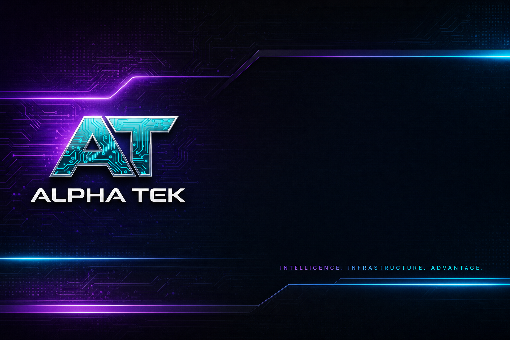

<!--
  PUBLIC PROFILE README — JohnnyxSmokes/JohnnyxSmokes
  Product hub. No private monorepo links or stack dumps.
-->

<p align="center">
  <a href="https://www.alphatek.app">
    
  </a>
</p>

<div align="center">

  <h1>EpicAlpha · AlphaTek</h1>

  <p>
    <strong>Crypto OG · Building in public · Shipping privately until release</strong>
  </p>

  <p>
    Free crypto intelligence first. Sustainable platform second.<br />
    <strong>14+ year crypto vet</strong> — trader · developer · BTC 2012 OG — building real tools, not vaporware.
  </p>

  <p>
    <a href="https://www.alphatek.app">
      
    </a>
    &nbsp;
    <a href="https://discord.gg/EpicAlpha">
      
    </a>
    &nbsp;
    <a href="https://www.alphatek.app/changelog">
      
    </a>
  </p>

  <!-- One X logo only — three handles, no doubled X label -->
  <p>
    <a href="https://x.com/BitcoinHomework">
      
    </a>
    &nbsp;
    <a href="https://x.com/AlphaTekBot">
      
    </a>
    &nbsp;
    <a href="https://x.com/MTRDevelopers">
      
    </a>
  </p>

  <p>
    
    
    
    
    
  </p>

</div>

---

## Who I Am

**JohnnyxSmokes** — he/him · Tampa, FL · building **Epic Alpha** and **Alpha Tek**.

**14+ years in crypto** (since the **2012 BTC era**): trader, developer, and multiproject operator — not a 2020s narrative that started yesterday. Long tenure includes free education work under brands like **Bitcoin Homework**, earlier social/trading and market products across cycles, and a deep **Bitcointalk-era** footprint with posts and thread history that predate most of today’s “OG” timelines. Ask around the old forums if you want primary sources; the calendar math is simple — 2012 → now is fourteen years of scars, charts, ships, and rebuilds.

The current chapter is Alpha Tek: give people who got burned, who refuse to get burned again, or who only have a little to start with **real intelligence** — free tools and free community first, paid depth when it earns its keep.

Hard build stays **private by default**. Public presence is the story, live products, product footprints, and (when it matters) inspectable packages like the browser extension.

---

## What Is Alpha Tek?

**Alpha Tek** is a full **crypto intelligence ecosystem** — not a single app with three tabs.

| Plane | What it is |
|-------|------------|
| **[AlphaTek.App](https://www.alphatek.app)** | Live web portal — Explorer, Discover, TG Arena, KOL, Guard, Academy, AAI Hub |
| **[Epic Alpha Discord](https://discord.gg/EpicAlpha)** | Free community + **200+ Tek channels** + command surface |
| **Discord licensing** | Commercial Tek packs for other servers (**$299 / $799 / $1,999**) |
| **Alpha Trench** | Browser trench client — pair-page shell, Guard, practice rails |
| **AAI Hub** | Utility cockpit — stake, tiers, XP, flywheel entry |

One brand. Free first. Sustainable flywheels so free tools survive.

**Read the full synopsis:** [alpha-tek-whitepaper](https://github.com/JohnnyxSmokes/alpha-tek-whitepaper)

---

## Public Product Repositories

Docs + banners only (or, for Alpha Trench, inspectable packages when released). **No private monorepo dumps.**

| Product | Public repo | Live |
|---------|-------------|------|
| **Ecosystem whitepaper** | [JohnnyxSmokes/alpha-tek-whitepaper](https://github.com/JohnnyxSmokes/alpha-tek-whitepaper) | Synopsis + chapters |
| **Web portal** | [JohnnyxSmokes/alpha-tek-portal](https://github.com/JohnnyxSmokes/alpha-tek-portal) | [alphatek.app](https://www.alphatek.app) |
| **Epic Alpha Discord** | [JohnnyxSmokes/epic-alpha-discord](https://github.com/JohnnyxSmokes/epic-alpha-discord) | [discord.gg/EpicAlpha](https://discord.gg/EpicAlpha) |
| **Discord licensing** | [JohnnyxSmokes/discord-licensing](https://github.com/JohnnyxSmokes/discord-licensing) | $299 / $799 / $1,999 tiers |
| **AAI Hub** | [JohnnyxSmokes/aai-hub](https://github.com/JohnnyxSmokes/aai-hub) | [alphatek.app/dashboard/aai](https://www.alphatek.app/dashboard/aai) |
| **Alpha Trench** | [JohnnyxSmokes/alpha-trench](https://github.com/JohnnyxSmokes/alpha-trench) | Portal link · store TBD |

---

## Build Journey · Changelog

Every serious shipping streak should leave a receipt.

| Surface | What you see |
|---------|----------------|
| **[alphatek.app/changelog](https://www.alphatek.app/changelog)** | **Build Journey** — public ship log, heat, milestones |
| **[This GitHub profile](https://github.com/JohnnyxSmokes)** | Contribution graph + activity (private repos keep source closed) |

The changelog is where product narrative meets timestamps. The green boxes are proof of process. Both matter.

---

## How I Build

| Principle | Meaning |
|-----------|---------|
| **Free first** | Tools and community before gates |
| **Honesty ladder** | Practice marks before live size |
| **Alpha brand** | One public label — not vendor cosplay |
| **Ship privately, prove publicly** | Core IP closed; auditables open when needed |
| **Sustainability** | Subs + licensing + AAI utility → free layer lives |
| **Daily depth** | **Cursor Day 81+** of intense product shipping with AI-assisted engineering — heat shows on GitHub |

Want the raw operator footprint? Scroll the contribution graph on this profile. Thousands of commits; most monorepo detail stays private **on purpose**.

---

## Public Vs Private

```text
PUBLIC
  · This profile · product README repos · live portal · Discord invite
  · Build Journey changelog · contribution heat
  · Alpha Trench package + VirusTotal when released

PRIVATE
  · Platform monorepo · agents · ingestion · unpaid R&D · ops secrets
```

Cloning a green square is not possible. Cloning **fourteen years** of multiproject trenches is also not free.

---

## Find Me

| Channel | Link |
|---------|------|
| **Portal** | [AlphaTek.App](https://www.alphatek.app) |
| **Changelog** | [Build Journey](https://www.alphatek.app/changelog) |
| **Discord** | [discord.gg/EpicAlpha](https://discord.gg/EpicAlpha) |
| **Whitepaper** | [alpha-tek-whitepaper](https://github.com/JohnnyxSmokes/alpha-tek-whitepaper) |
| **X (main)** | [@BitcoinHomework](https://x.com/BitcoinHomework) |
| **X (bot)** | [@AlphaTekBot](https://x.com/AlphaTekBot) |
| **X (dev)** | [@MTRDevelopers](https://x.com/MTRDevelopers) |

---

## For Operators And Investors

If you care about:

- free tools that still exist because the project is becoming sustainable  
- real multi-surface tech (web + Discord + extension)  
- AAI as utility — not only ticker theater  
- replication cost measured in **years of ops**, not slides  

…start at [AlphaTek.App](https://www.alphatek.app), join [Discord](https://discord.gg/EpicAlpha), and read the [ecosystem whitepaper synopsis](https://github.com/JohnnyxSmokes/alpha-tek-whitepaper).

---

<div align="center">

  <sub>
    Built with passion since BTC 2012 · Tampa · Epic Alpha · Alpha Tek<br />
    Core repositories private · Public story and auditables by design
  </sub>

</div>
